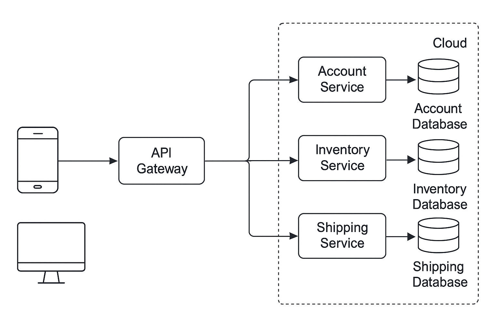

# ☁️ Cloud-Based E-Commerce Platform with Automated DevOps Pipeline


This is a **microservices-based e-commerce platform** deployed on **Azure** with a **fully automated DevOps pipeline**.  

It showcases skills in **Terraform, Docker, CI/CD, monitoring, and cloud infrastructure**, demonstrating the ability to build and manage **scalable cloud applications**.

---

## 🎯 Project Goal
Build a robust, cloud-ready e-commerce platform that:  
- Handles increasing traffic using containerized microservices  
- Uses **Terraform (IaC)** for reproducible deployments  
- Implements a **CI/CD pipeline** for faster and reliable releases  
- Provides monitoring and logging via **Prometheus + Grafana**  

---

## 🔹 Features Implemented

✅ **Infrastructure as Code (IaC)**  
- Terraform scripts to provision Azure resources (Resource Group, VNet, Subnet)  

✅ **Containerization**  
- All services Dockerized with Docker Compose  

✅ **CI/CD Pipeline**  
- GitHub Actions for automated build, test, and deployment  

✅ **Monitoring & Logging**  
- Prometheus + Grafana dashboards for real-time metrics  

---

## 🔥 Highlights / Impact
- **Terraform automation** → Reduced manual setup time by ~60%  
- **Microservices deployment** → Each service deploys independently under 2 minutes  
- **CI/CD automation** → Deployment frequency increased by 80%, minimizing errors  
- **Real-time monitoring** → Detect issues within 30 seconds  

---

## 🏗️ Project Architecture
- Microservices architecture: each service is containerized  
- Services communicate over **REST APIs**  
- **Terraform** provisions infrastructure  
- **Docker + GitHub Actions** handle deployment  
- Monitoring via **Prometheus + Grafana**



---

## 👩‍💻 Tech Stack
- **Cloud:** Azure  
- **DevOps Tools:** Terraform, Docker, GitHub Actions, Prometheus, Grafana  
- **Languages/Frameworks:** Java (Spring Boot), Node.js  

---

## 📂 Repository Structure

```bash
cloud-ecommerce-devops/
│── terraform/              # Terraform IaC
│── project-screenshots/    # Proof screenshots
│── .github/                # GitHub Actions workflows
│── Dockerfile              # Docker setup
│── README.md               # Documentation
```

---

## 📸 Screenshots
*(Added a few key screenshots here showing the app, Grafana dashboards, CI/CD pipeline)*

### 🌐 Web / App Screenshots

**Welcome to Nginx**  


**WeaveSocks UI**  


---

### 📊 Grafana / Monitoring

**Grafana / Prometheus Query Setup**  


**Grafana Login Page**  


**Grafana Dashboard - Overview**  


**Grafana Dashboard - Node Exporter**  


---

### 💻 Code / CI-CD

**Go Module Stats**  


**CI/CD Pipeline Demo**  


---

## 🚀 How to Run

1. **Clone this repository:**  
```bash
git clone https://github.com/KritikaK21/cloud-ecommerce-devops.git
cd cloud-ecommerce-devops
```
2. Deploy infrastructure with Terraform:
``` bash
cd terraform
terraform init
terraform apply
```
3. Build & run with Docker:
``` bash
docker-compose up --build
```
4. Access services locally

- Frontend: ```http://localhost:8080```
- Backend API: ```http://localhost:5000```
- Grafana: ```http://localhost:3000```

5. Stop the project
```bash
docker-compose down
```

---

## 🌍 Live Demo

A live deployment will be available soon (link will be added here).

## 📌 Work in Progress

- Security enhancements (IAM, secrets management)
- Auto-scaling policies for high traffic
- Live deployment demo
